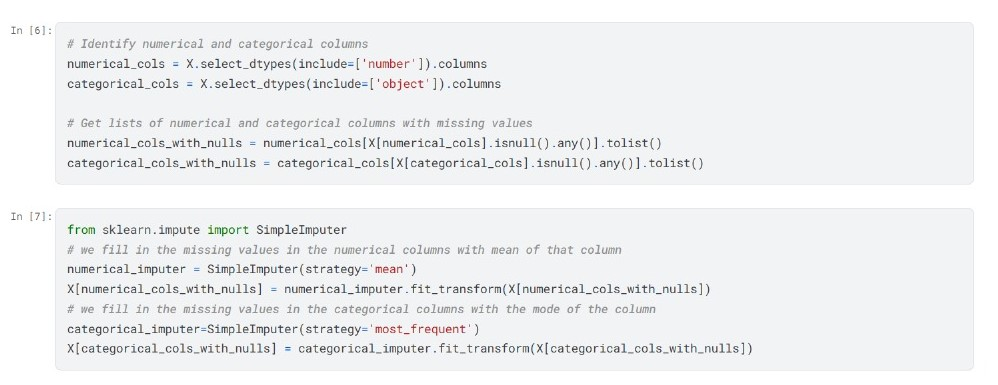
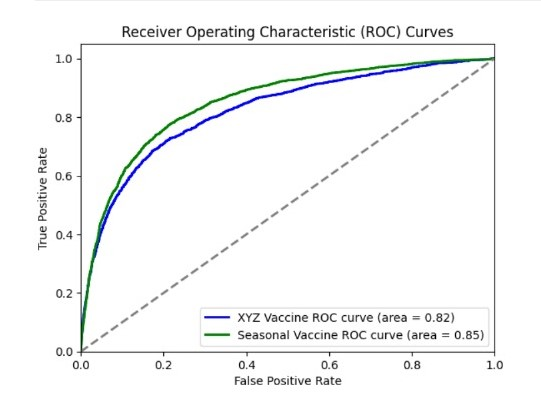

# Logistic Regression - Vaccine Prediction

## Problem Description
- Our goal is to predict how likely individuals are to receive their xyz and seasonal flu
vaccines. 
- Specifically, we'll be predicting two probabilities: one for xyz_vaccine and
one for seasonal_vaccine.

## Tech Stack/Frameworks:
- Model Training, Evaluation :Scikit Learn
* Data Cleaning: Pandas
+ Data Visualization: Seaborn,Matplotlib

## Handling Missing values:
- First we identify the numerical and categorical columns
- Next we fill the missing values in those columns using SimpleImputer 
- Mean values for numerical columns and most frequent values for categorical columns
- We had to do this for both the training data(in hackathon.ipynb) and for the testing data (in hackathon-clean.ipynb)
- 

## Data Visualization:
- I used seaborn to visually identify the columns containing the most amount of missing values , using the heatmap feature
- [heatmap](data/heatmap.jpg)

## Evaluation:
- I used matplotlib to draw the AUC-ROC curve for both the labels 
- It helped us calculate the auc-roc score for the model using the diagram 
- 

